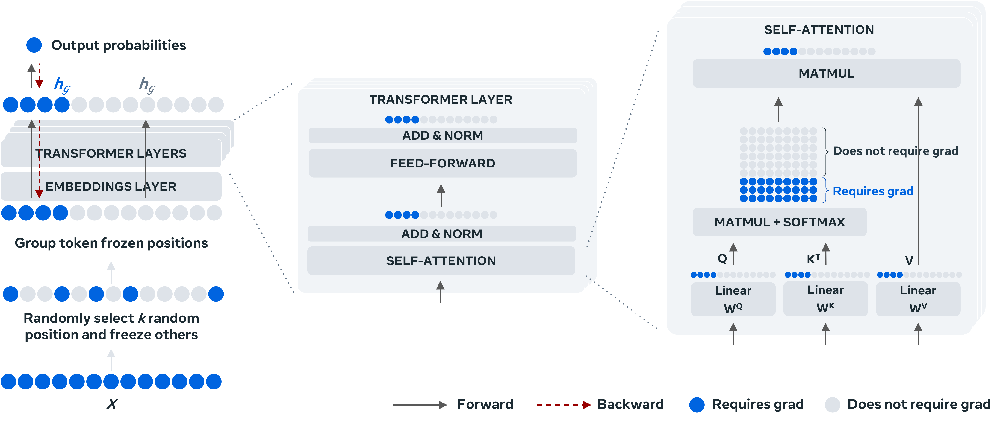

# TokenTune: Memory-Efficient Fine-Tuning of Transformers via Token Selection



This repository provides the code of the TokenTune framework presented in the paper ["Memory-Efficient Fine-Tuning of Transformers via Token Selection"](https://aclanthology.org/2024.emnlp-main.1202.pdf), [Antoine Simoulin*](https://simoulin.io/), [Namyong Park*](https://namyongpark.github.io/), Xiaoyi Liu, Grey Yang, [EMNLP](https://2024.emnlp.org/) 2024. TokenTune presents a novel method for reducing memory usage in the fine-tuning of transformer-based models. By approximating gradient computation through a subset of input tokens during the backward pass, TokenTune reduces the need to cache intermediate activations, resulting in significant memory savings while maintaining performance on par with full fine-tuning or other memory-efficient fine-tuning methods.

_\* Equal contribution_

## Abstract

<details><summary>Abstract</summary>
Fine-tuning provides an effective means to specialize pre-trained models for various downstream tasks. However, fine-tuning often incurs high memory overhead, especially for large transformer-based models, such as LLMs. While existing methods may reduce certain parts of the memory required for fine-tuning, they still require caching all intermediate activations computed in the forward pass to update weights during the backward pass. In this work, we develop TokenTune, a method to reduce memory usage, specifically the memory to store intermediate activations, in the fine-tuning of transformer-based models. During the backward pass, TokenTune approximates the gradient computation by backpropagating through just a subset of input tokens. Thus, with TokenTune, only a subset of intermediate activations are cached during the forward pass. Also, TokenTune can be easily combined with existing methods like LoRA, further reducing the memory cost. We evaluate our approach on pre-trained transformer models with up to billions of parameters, considering the performance on multiple downstream tasks such as text classification and question answering in a few-shot learning setup. Overall, TokenTune achieves performance on par with full fine-tuning or representative memory-efficient fine-tuning methods, while greatly reducing the memory footprint, especially when combined with other methods with complementary memory reduction mechanisms. We hope that our approach will facilitate the fine-tuning of large transformers, in specializing them for specific domains or co-training them with other neural components from a larger system.
</details>

## How to Install

You can create a conda environment and install the dependencies with the following commands:
```bash
conda create -n tokentune python=3.9 -y
conda activate tokentune
pip install -r requirements.txt
```

## Prerequisites

### Hugging Face Hub Authentication
Since our code requires access to the Hugging Face Hub, you first need to create a user access token if you haven’t done so already. 
To do this, follow the instructions provided at https://huggingface.co/docs/hub/en/security-tokens.

Once the access token is created, it can be used to authenticate your access. One way to do this is via an environment variable, as shown below.
```bash
export HF_TOKEN="hf_xxxxxxxxxxxxx"
```
For other methods of authentication, please refer to [this page](https://huggingface.co/docs/huggingface_hub/en/quick-start).

### Setting Up lm-evaluation-harness for Evaluation
For evaluation, we use EleutherAI’s [lm-evaluation-harness](https://github.com/EleutherAI/lm-evaluation-harness/tree/v0.4.2) (v0.4.2). 
The following commands set up a separate conda environment and install the `lm_eval` package. For more detailed instructions, please refer to [this page](https://github.com/EleutherAI/lm-evaluation-harness/tree/v0.4.2).
```bash
conda create -n lm-eval python=3.8 -y
conda activate lm-eval
git clone --branch v0.4.2 https://github.com/EleutherAI/lm-evaluation-harness
cd lm-evaluation-harness
pip install -e .
```

## How to Run

To train a model with TokenTune, use the [finetune.py](tokentune/finetune.py) script with the corresponding arguments.
For example, to reproduce the fine-tuning of the Llama-2 model using TokenTune with LoRA on the Platypus dataset, use the command below.
We provide the commands with the parameters used to produce the Figure 1 in the paper. 
You can use the scripts in the [scripts/train](scripts/train) folder. e.g. `bash scripts/train/lora_tokentune_platypus_llama_2.sh`.

```bash
# cd to the project root
python -u ./tokentune/finetune.py \
    --model_name_or_path meta-llama/Llama-2-7b-hf \
    --dataset_name_or_path garage-bAInd/Open-Platypus \
    --prompt_template_name_or_path ./tokentune/alpaca_template.json \
    --global_batch_size 32 \
    --gradient_accumulation_steps 32 \
    --num_epochs 1 \
    --num_workers 4 \
    --learning_rate 4e-4 \
    --weight_decay 0.01 \
    --warmup_steps 100 \
    --lr_scheduler_type cosine \
    --model_save_path ./models/ \
    --save_steps 1000 \
    --save_total_limit 2 \
    --max_length 2048 \
    --tokentune \
    --lora \
    --bf16 \
    --prefix_length 0.3
```
When running [finetune.py](tokentune/finetune.py) with LoRA or QLoRA, only the adapter weights are saved.
By default, after fine-tuning is completed, the training scripts in [scripts/train](scripts/train) subsequently execute [merge.py](tokentune/merge.py),
which reconstructs the full checkpoint by merging the adapter weights with the pretrained weights.
To perform the merging step separately, you can use the [scripts/merge.sh](scripts/merge.sh) script or the following command. Depending on your configuration, update the arguments `base_model_name_or_path`, `peft_model_path`, and `output_dir` accordingly.
```bash
# cd to the project root
python ./tokentune/merge.py \
    --base_model_name_or_path meta-llama/Llama-2-7b-hf \
    --peft_model_path ./models/meta-llama-Llama-2-7b-hf-garage-bAInd-Open-Platypus-lora-tokentune-0.3/ \
    --output_dir ./models/meta-llama-Llama-2-7b-hf-garage-bAInd-Open-Platypus-lora-tokentune-0.3/merged
```

Finally, you can run the evaluation on the following datasets: ARC, HellaSwag, MMLU, TruthfulQA, and WinoGrande.
You can use the following command or the scripts in [scripts/eval](scripts/eval).

```bash
# cd to the parent directory of the project root
conda activate lm-eval
accelerate launch -m lm_eval \
  --model hf-auto \
  --model_args pretrained=./models/meta-llama-Llama-2-7b-hf-garage-bAInd-Open-Platypus-lora-tokentune-0.3/merged \
  --tasks arc_challenge \
  --batch_size 20 \
  --output_path ./results/meta-llama-Llama-2-7b-hf-garage-bAInd-Open-Platypus-lora-tokentune-0.3/merged/arc_challenge_25shot.json \
  --device cuda \
  --num_fewshot 25
```

## Directory Structure

This repository is structured as follows. 

```bash
.
├── scripts   # bash scripts to reproduce experiments from the paper
│   ├── eval  # bash scripts to reproduce evaluation results from the paper
│   └── train # bash scripts to reproduce training of the models
└── tokentune # code files for models and dataloading
```

## Citation
If you use code in this repository in your own work, please cite our paper.
```bibtex
@inproceedings{emnlp2024tokentune,
  title={Memory-Efficient Fine-Tuning of Transformers via Token Selection},
  author={Antoine Simoulin and Namyong Park and Xiaoyi Liu and Grey Yang},
  booktitle = "Proceedings of the 2024 Conference on Empirical Methods in Natural Language Processing",
  url = "https://aclanthology.org/2024.emnlp-main.1202/",
  doi = "10.18653/v1/2024.emnlp-main.1202",
  year={2024},
}
```

## License
The majority of TokenTune is licensed under CC-BY-NC, however portions of the project are available under separate license terms:
Transformers and Platypus are licensed under the Apache 2.0 license.

## Contributing
See the [CONTRIBUTING](CONTRIBUTING.md) file for how to contribute to the project.
